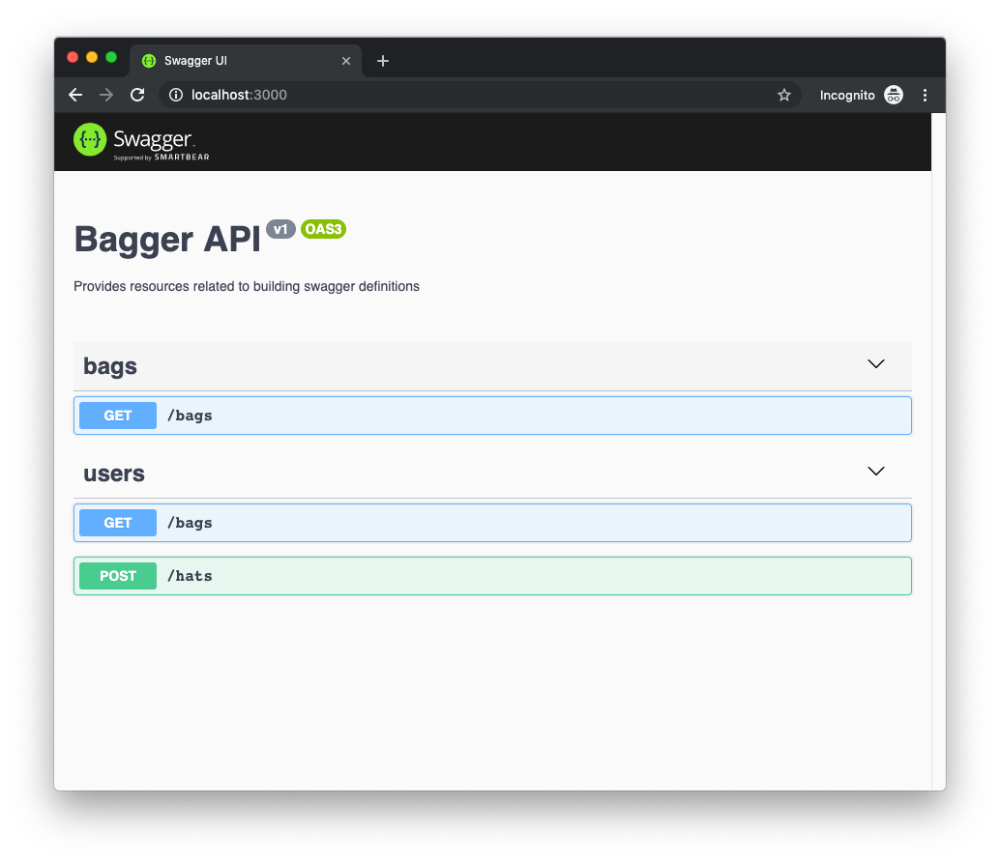
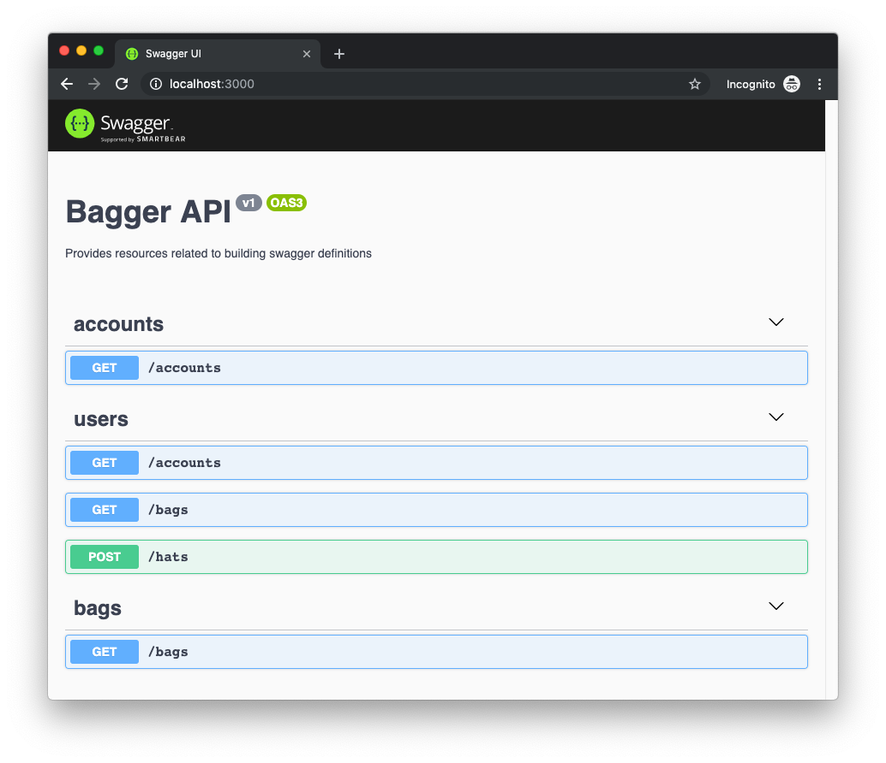

# Introduction

The `bagger` library exposes different methods for configurating a swagger definition and creating reusable bagger resources. Finally when bagger is configurated it can be compiled into a swagger definition

The configuration methods are:

- `bagger.configure()`
- `bagger.addRequest(path, method)`
- `bagger.addComponent()`

The resource creation methods are:

- `bagger.response(httpCode)`
- `bagger.requestBody()`
- `bagger.parameter()`

Bagger is compiled by calling `bagger.compile()`.

## Getting started

Install Bagger by running:

```
npm init -y && npm install @digitalroute/bagger
```

Bagger can be used with any web framework like koa or hapi, but we will use express for this example. We will also use swagger-ui-express to serve a Swagger web page.

```
npm install express swagger-ui-express @hapi/joi
```

### Create your server file

Create a file called `server.js` in the project root directory:

```js
const express = require('express');
const bagger = require('@digitalroute/bagger');
const swaggerUi = require('swagger-ui-express');
const joi = require('@hapi/joi');

const app = express();

const defaultInfo = {
  title: 'Bagger API',
  version: 'v1',
  description: 'Provides resources related to building swagger definitions'
};

bagger.configure().info(defaultInfo);

bagger
  .addRequest('/bags', 'get')
  .addTag('bags')
  .addTag('users')
  .addResponse(bagger.response(200).description('Good fetch'));

bagger
  .addRequest('/hats', 'post')
  .addTag('users')
  .body(
    bagger
      .requestBody()
      .description('A body')
      .required(true)
      .content(
        'application/json',
        joi
          .object()
          .keys({ a: joi.string().required() })
          .example({ a: 'hello' })
      )
  )
  .addResponse(bagger.response(200).description('Good post'));

app.use('/', swaggerUi.serve, swaggerUi.setup(bagger.compile()));

app.listen(3000, () => {
  console.log('Server started on port 3000');
});
```

`bagger.configure` is used to set the general information about the api. `bagger.addRequest` adds requests to the configuration. `swaggerUi.serve` and `swaggerUi.setup(bagger.compile())` creates the Swagger definition and serves it on a web page.

### Start the server

Run `node server.js` and open `localhost:3000` in a browser. You should see something like this:



## Working with multiple files

It is possible to configuer bagger in multiple files. The only important thing is that `bagger.compile()` is called last.

### Add a second file

Create a file called `accounts.js` in the project root directory:

```js
const bagger = require('@digitalroute/bagger');

bagger
  .addRequest('/accounts', 'get')
  .addTag('accounts')
  .addTag('users')
  .addResponse(bagger.response(200).description('Good fetch'));
```

### Include the new file

Update the beginning of `server.js` so that it includes `account.js`

```js
const express = require('express');
const bagger = require('@digitalroute/bagger');
const swaggerUi = require('swagger-ui-express');
const joi = require('@hapi/joi');
require('./accounts'); // <-- new line

// ...
```

### Start the server again

Now when running `node server.js` the web page should look like this:


